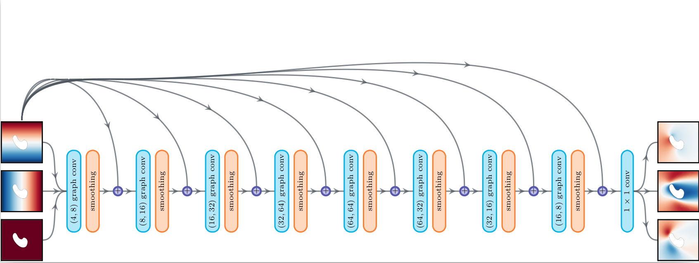

This is the git repository for the paper '[Graph neural networks for laminar flow prediction around random 2D shapes](https://www.google.com)'


The proposed graph convolutional neural network works on triangular meshes. It takes the coordinates of nodes and the binary encoding of the solid surface as the inputs. It predicts velocity and pressure fields around random 2D shapes at a low Reynolds number. Compare to U-nets, the graph models have higher accuracy, require fewer trainable parameters, take longer time for training.

<p align="center">
  
</p>

The data set contains 2000 random 2D obstacles, together with the laminar velocity and pressure field. It was also used in the articles by:
- J. Viquerat and E. Hachem, "[A supervised neural network for drag prediction of arbitrary 2D shapes in laminar flows at low Reynolds number](https://github.com/jviquerat/cnn_drag_prediction)"
- J. Chen, J. Viquerat and E. Hachem, "[A twin-decoder structure for incompressible laminar flow reconstruction with uncertainty estimation around 2D obstacles](https://github.com/jviquerat/twin_autoencoder)"

The entire project are has been validated in **Ubuntu 20.04**. To reproduce the results, it is preferred to creat a virtual environment with **python==3.6.9**, and install the packages listed in **requirements.txt**.

## Structure of the repository
- **dataset_utils** : functions concerning the data
- **network_utils** : functions and classes concerning the convolutional blocks and network architecture
- **params** : directions, network hyper-parameters etc..
- **predict** : get the flow prediction and drag force of a cylinder or a NACA0012 airfoil
- **predict_testset**: get the flow prediction and drag force of all the shapes in the test set
- **training** : the main function for training a neural network
- **training_utils** : functions used for custom training loops
- **best_model** : save model parameters during the training process

## Model training
To train a model, run
```
python3 training.py
```

Network hyper-parameters are configurable in
```
params.py
```

Network architecture is defined in
```
network_utils.py
```


